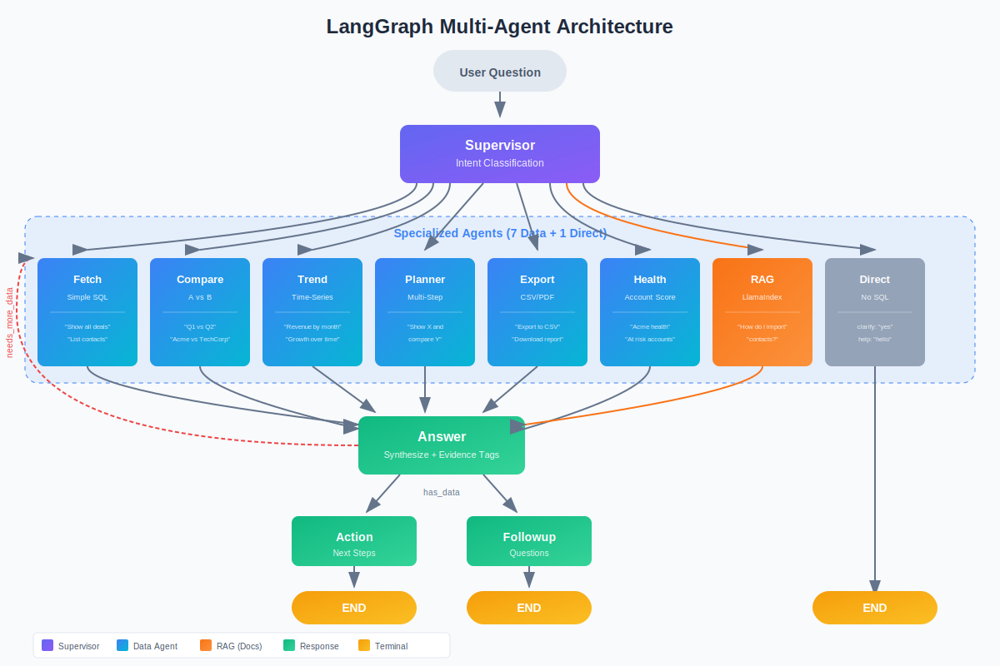

# Acme CRM AI Companion

An AI-powered CRM assistant that answers natural language questions about your CRM data using a **multi-agent LangGraph pipeline** with Supervisor routing and data refinement loops. Built with FastAPI backend and React frontend.

## Architecture



### Multi-Agent Pipeline

The system uses **8 intents** routed by a Supervisor to **6 specialized data agents**:

| Agent | Intent | Purpose | Example Query |
|-------|--------|---------|---------------|
| **Fetch** | `data_query` | Simple SQL queries | "Show all deals" |
| **Compare** | `compare` | A vs B analysis | "Q1 vs Q2 revenue" |
| **Trend** | `trend` | Time-series analysis | "Revenue by month" |
| **Planner** | `complex` | Multi-step orchestration | "Show X and compare Y" |
| **Export** | `export` | CSV/PDF/JSON generation | "Export to CSV" |
| **Health** | `health` | Account health scoring | "Acme health score" |

Plus direct responses for `clarify` (vague questions) and `help` (usage questions).

### Response Pipeline

| Node | Purpose | LLM Provider |
|------|---------|--------------|
| **Supervisor** | Classifies intent → routes to specialized agent | GPT-4o-mini |
| **Answer** | Synthesizes data with evidence tags `[E1]`, `[E2]` | GPT |
| **Action** | Suggests next steps based on results | GPT |
| **Followup** | Generates relevant follow-up questions | GPT |

### Key Design Decisions

- **Supervisor routing**: Classifies 8 intents using heuristics-first (fast) with LLM fallback
- **Specialized agents**: Each agent optimized for its query type (comparison metrics, trend analysis, etc.)
- **Data refinement loops**: Answer can request additional Fetch iterations (max 2) when data is incomplete
- **SQL Safety Guard**: All LLM-generated SQL validated with sqlglot (blocks INSERT/UPDATE/DELETE)
- **Multi-provider LLM**: Claude for SQL planning (structured output), GPT for synthesis
- **Evidence-based answers**: Responses include `[E1]`, `[E2]` tags linking claims to data
- **Streaming UX**: SSE streaming for real-time progress and token delivery

## Project Structure

```
acme-crm-ai-companion/
├── backend/
│   ├── api/
│   │   ├── chat.py              # Chat streaming endpoint
│   │   ├── data.py              # Data explorer endpoints
│   │   └── health.py            # Health check
│   ├── agent/
│   │   ├── graph.py             # LangGraph workflow with Supervisor routing
│   │   ├── state.py             # Agent state schema (intent, loop_count, etc.)
│   │   ├── streaming.py         # SSE event streaming
│   │   ├── supervisor/          # Intent classification & routing
│   │   │   ├── node.py          # Supervisor node implementation
│   │   │   └── classifier.py    # Intent classifier (heuristics + LLM)
│   │   ├── fetch/
│   │   │   ├── node.py          # Fetch node with retry logic
│   │   │   ├── planner.py       # SQL planning chain (Claude)
│   │   │   └── sql/
│   │   │       ├── guard.py     # SQL safety validation (sqlglot)
│   │   │       ├── executor.py  # DuckDB execution
│   │   │       └── schema.py    # Schema introspection
│   │   ├── supervisor/          # Intent classification + routing
│   │   ├── compare/             # A vs B comparison queries
│   │   ├── trend/               # Time-series analysis
│   │   ├── planner/             # Multi-step query orchestration
│   │   ├── export/              # CSV/PDF/JSON generation
│   │   ├── health/              # Account health scoring
│   │   ├── answer/              # Response synthesis with evidence
│   │   ├── action/              # Next step suggestions
│   │   ├── followup/            # Follow-up question generation
│   │   └── validate/            # Output validators with repair loops
│   │       ├── answer.py        # Answer format validation
│   │       ├── action.py        # Action format validation
│   │       └── followup.py      # Followup format validation
│   ├── eval/                    # Evaluation framework (RAGAS)
│   ├── data/csv/                # CRM data files
│   └── main.py                  # FastAPI app
├── frontend/
│   ├── src/
│   │   ├── components/          # React components
│   │   ├── hooks/               # Custom hooks (useChatStream)
│   │   └── styles/              # CSS
│   └── e2e/                     # Playwright E2E tests
├── tests/                       # Backend unit tests
└── scripts/ci.sh                # Local CI runner
```

## Tech Stack

### Backend
- **Framework**: FastAPI + Uvicorn
- **Agent**: LangGraph with memory checkpointing
- **Database**: DuckDB (in-memory SQL over CSV)
- **LLMs**: OpenAI GPT (answers), Anthropic Claude (SQL planning)
- **Validation**: Pydantic v2

### Frontend
- **Framework**: React 18 + TypeScript 5
- **Build**: Vite 5
- **Testing**: Vitest + Playwright

## Quick Start

### Prerequisites
- Python 3.10+
- Node.js 18+
- OpenAI API key
- Anthropic API key (optional, falls back to OpenAI)

### Backend

```bash
# Create virtual environment
python -m venv .venv
source .venv/bin/activate  # Windows: .venv\Scripts\activate

# Install dependencies
pip install -r requirements.txt

# Set environment variables
export OPENAI_API_KEY=your-key
export ANTHROPIC_API_KEY=your-key  # Optional

# Run
python -m uvicorn backend.main:app --reload --port 8000
```

### Frontend

```bash
cd frontend
npm install
npm run dev
```

Open http://localhost:5173

## API Reference

### Stream Chat Response

```http
POST /api/chat/stream
Content-Type: application/json

{
  "question": "What deals are in the pipeline?",
  "session_id": "optional-session-id"
}
```

Returns Server-Sent Events (SSE):
```
event: fetch_start
data: {"node": "fetch"}

event: answer_chunk
data: {"content": "Based on the data..."}

event: action
data: {"suggestions": ["Export to CSV", "Schedule follow-up"]}

event: followup
data: {"questions": ["Which reps own these deals?", "..."]}

event: done
data: {}
```

### Starter Questions

```http
GET /api/chat/starter-questions
```

### Health Check

```http
GET /api/health
```

## Testing

```bash
# Run all CI checks
./scripts/ci.sh all

# Backend only (420 tests)
./scripts/ci.sh backend

# Frontend only (562 tests)
./scripts/ci.sh frontend

# E2E tests (167 tests)
cd frontend && npm run test:e2e
```

## Environment Variables

| Variable | Description | Required |
|----------|-------------|----------|
| `OPENAI_API_KEY` | OpenAI API key | Yes |
| `ANTHROPIC_API_KEY` | Anthropic API key for SQL planning | No |
| `MOCK_LLM` | Enable mock LLM for testing | No |
| `ACME_LOG_LEVEL` | Logging level (DEBUG, INFO, etc.) | No |

## Evaluation

The project includes a RAGAS-based evaluation framework:

```bash
# Run answer quality evaluation
python -m backend.eval.answer

# Run followup evaluation
python -m backend.eval.followup
```

Metrics tracked:
- **Faithfulness**: Are claims grounded in retrieved data?
- **Answer Relevancy**: Does the answer address the question?
- **Correctness**: Is the answer factually accurate?

## License

This project is for demonstration purposes.
