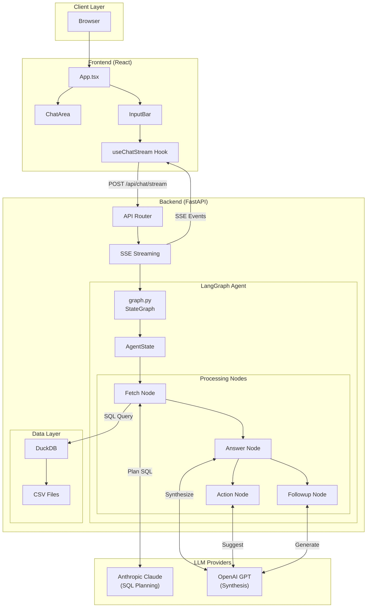
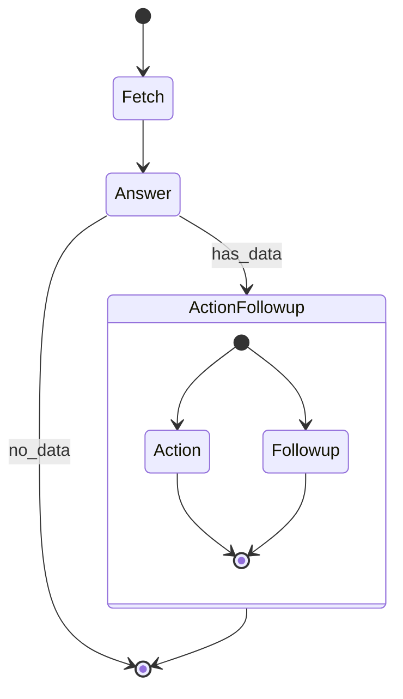
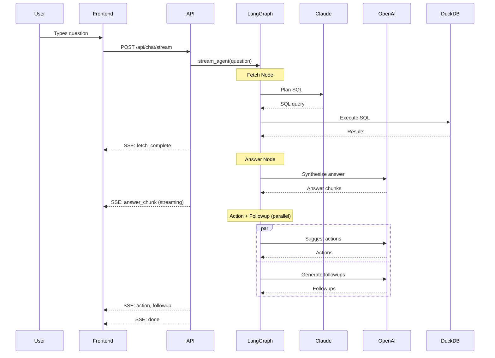

# Architecture

This document describes the system architecture of the Acme CRM AI Companion.

## Overview

The system is a conversational AI assistant that answers natural language questions about CRM data. It uses a multi-step LangGraph agent pipeline with specialized nodes for data retrieval, answer synthesis, and follow-up generation.

## System Diagram



## Agent Pipeline

The agent uses LangGraph to orchestrate a multi-step processing pipeline:



### Node Responsibilities

#### 1. Fetch Node (`backend/agent/fetch/`)

**Purpose**: Convert natural language to SQL and retrieve data.

**Components**:
- `planner.py`: Uses Claude to generate SQL from the question + schema
- `sql/executor.py`: Executes SQL against DuckDB
- `sql/schema.py`: Provides schema information to the planner

**Flow**:
```
Question → Claude (SQL Planning) → SQL Query → DuckDB → Results
```

**Why Claude?**: Claude provides better structured output for SQL generation with fewer hallucinated column names.

#### 2. Answer Node (`backend/agent/answer/`)

**Purpose**: Synthesize a human-readable answer from the data.

**Key Features**:
- Evidence tagging: Claims are linked to data via `[E1]`, `[E2]` markers
- Strict grounding: Only facts from retrieved data are allowed
- Structured output: Answer / Evidence / Data not available sections

**Prompt Contract**:
```
You MUST:
- Only use facts from CRM DATA section
- Tag each claim with evidence markers [E1], [E2]...
- List evidence sources at the end
- Say "I don't have that information" if data is missing
```

#### 3. Action Node (`backend/agent/action/`)

**Purpose**: Suggest actionable next steps based on the answer.

**Output**: 1-4 action suggestions (or NONE if not applicable)

**Examples**:
- "Export this data to CSV"
- "Schedule a follow-up call"
- "Create a renewal reminder"

#### 4. Followup Node (`backend/agent/followup/`)

**Purpose**: Generate relevant follow-up questions.

**Strategy**:
1. First, try static followup tree (fast, deterministic)
2. If no match, use LLM to generate schema-aware questions

**Output**: Exactly 3 follow-up questions, each under 10 words.

## Data Flow

### Request Flow



### State Schema

```python
class AgentState(TypedDict):
    question: str              # User's input question
    sql_results: dict          # {sql: str, data: list, error: str}
    answer: str                # Synthesized answer
    action: str | None         # Action suggestions
    followups: list[str]       # Follow-up questions
```

## LLM Strategy

### Multi-Provider Design

| Task | Provider | Model | Reason |
|------|----------|-------|--------|
| SQL Planning | Anthropic | Claude | Better structured output, fewer hallucinations |
| Answer Synthesis | OpenAI | GPT | Good at natural language synthesis |
| Action Suggestions | OpenAI | GPT | Creative suggestions |
| Followup Generation | OpenAI | GPT | Question generation |

### Fallback Behavior

If Anthropic API is unavailable, the system falls back to OpenAI for SQL planning.

## Streaming Architecture

The system uses Server-Sent Events (SSE) for real-time updates:

```python
# Event types
fetch_start      # Fetch node started
fetch_complete   # SQL executed, data retrieved
answer_chunk     # Streaming answer token
action           # Action suggestions ready
followup         # Follow-up questions ready
done             # Pipeline complete
error            # Error occurred
```

### Frontend Integration

```typescript
// useChatStream hook
const eventSource = new EventSource('/api/chat/stream');
eventSource.onmessage = (event) => {
  const data = JSON.parse(event.data);
  switch (data.type) {
    case 'answer_chunk':
      appendToAnswer(data.content);
      break;
    // ...
  }
};
```

## Evaluation Framework

The system includes a RAGAS-based evaluation framework:

### Metrics

| Metric | Description | Target |
|--------|-------------|--------|
| Faithfulness | Claims grounded in retrieved data | > 0.9 |
| Answer Relevancy | Answer addresses the question | > 0.85 |
| Correctness | Factually accurate answer | > 0.85 |

### Running Evaluations

```bash
# Answer quality evaluation
python -m backend.eval.answer

# Followup quality evaluation
python -m backend.eval.followup
```

## Security Considerations

### Current State
- SQL queries are LLM-generated and executed directly
- Input validation via Pydantic models
- CORS restrictions for frontend origins

### Recommended Improvements
- SQL injection prevention via query parsing
- Rate limiting on API endpoints
- Input sanitization for special characters

## Performance

### Latency Breakdown (typical)

| Stage | Latency |
|-------|---------|
| SQL Planning (Claude) | 500-800ms |
| SQL Execution (DuckDB) | 10-50ms |
| Answer Synthesis (GPT) | 1-2s |
| Action + Followup | 500ms |
| **Total** | **2-3.5s** |

### Optimization Opportunities
- Parallel LLM calls where possible
- Caching for common queries
- Streaming reduces perceived latency
